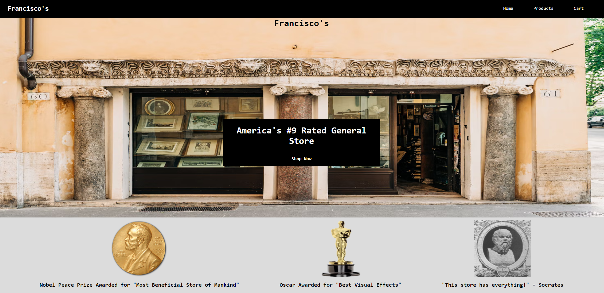

<div align="center">

  <h1>Awesome Readme Template</h1>
  
  <p>
    An awesome README template for your projects! 
  </p>

</div>

<br />

<!-- Table of Contents -->

# Table of Contents

- [About the Project](#about-the-project)
  - [Screenshots](#screenshots)
  - [Tech Stack](#tech-stack)
  - [Color Reference](#color-reference)
- [Getting Started](#getting-started)
  - [Run Locally](#run-locally)
  - [Deployment](#deployment)
- [Usage](#usage)

<!-- About the Project -->

## About the Project

<!-- Screenshots -->

### Screenshots

<div align="center"> 
  
</div>

<!-- TechStack -->

### Tech Stack

<details>
  <summary>Technologies</summary>
  <ul>
    <li><a href="https://reactjs.org/">React.js</a></li>
    <li><a href="https://react-redux.js.org/">React-Redux.js</a></li>
    <li><a href="https://reactrouter.com/">React-Router</a></li>

  </ul>
</details>

<!-- Color Reference -->

### Color Reference

| Color           | Hex                                                              |
| --------------- | ---------------------------------------------------------------- |
| Primary Color   |  #FFFFFF |
| Secondary Color |  #3B3A3A |
| Other Color     |  #000000 |

<!-- Getting Started -->

## Getting Started

<!-- Run Locally -->

### Run Locally

Clone the project

Can be cloned from https://github.com/San-toast/web/tree/main/week14/day1/e-commerce

Go to the project directory

```bash
  cd e-commerce
```

Install dependencies

```bash
  npm i
```

Start the server

```bash
  yarn start
```

<!-- Deployment -->

### Deployment

To deploy this project run

```bash
  npm start
```

<!-- Usage -->

## Usage

This project shows off the use of react-router, redux, and persistant storage to create a simple online store.

The index.js file requires many imports to get the application running.

```js
import React from "react";
import ReactDOM from "react-dom";
import "./index.css";
import App from "./App";
import Navbar from "./components/Navbar/Navbar";
import Cart from "./components/Cart/Cart";
import { createStore, applyMiddleware } from "redux";
import { Provider } from "react-redux";
import rootReducer from "./reducers/rootReducer";
import logger from "redux-logger";
import { BrowserRouter, Routes, Route } from "react-router-dom";
import { persistStore, persistReducer } from "redux-persist";
import storage from "redux-persist/lib/storage";
import { PersistGate } from "redux-persist/integration/react";
import ProductContainer from "./components/Products/ProductContainer";
import Error from "./components/Error/Error";
```

The persistant storage variables are setup below the imports

```js
const persistConfig = {
  key: "root",
  storage,
};
const persistedReducer = persistReducer(persistConfig, rootReducer);

const store = createStore(persistedReducer, applyMiddleware(logger));
let persistor = persistStore(store);
```

Finallly the routes are setup as follows

```js
ReactDOM.render(
  <React.StrictMode>
    <Provider store={store}>
      <PersistGate persistor={persistor}>
        <Navbar />
        <BrowserRouter>
          <Routes>
            <Route path="/" element={<App />} />
            <Route path="/cart" element={<Cart />} />
            <Route path="/products" element={<ProductContainer />} />
            <Route path="*" element={<Error />} />
          </Routes>
        </BrowserRouter>
      </PersistGate>
    </Provider>
  </React.StrictMode>,
  document.getElementById("root")
```

The rootReducer.js file contains the actions to alter some of the states

```js
function rootReducer(state = initialState, action) {
  switch (action.type) {
    case ADD_TO_CART:
      return {
        ...state,
        cart: [...state.cart, action.payload],
      };

    case REMOVE:
      return {
        ...state,
        cart: state.cart.filter((item) => item !== action.payload),
      };

    default:
      return state;
  }
}
```

Items are added to the cart with an onClick function setup in the Product.js component

```js
const dispatch = useDispatch();

const addToCart = (dispatch, product) => {
  dispatch({ type: ADD_TO_CART, payload: product });
};

<button
  onClick={() => {
    addToCart(dispatch, props.product);
  }}
>
  Add to Cart
</button>;
```

Items are removed from the cart with another onClick function in the CartItem.js component

```js
const dispatch = useDispatch();
const removeFromCart = (dispatch, product) => {
  dispatch({ type: REMOVE, payload: product });
};

<button onClick={() => removeFromCart(dispatch, props.product)}>Remove</button>;
```

You can read a little bit more about this project <a href="https://dev.to/santoast/simple-react-e-commerce-store-2bel">here</a>
